# 🧠 DYSLEXIS — A Web Platform for Dyslexia Support

*Live Site:* [Visit Dyslexis](https://sarthak2226cseai11.wixsite.com/my-site-12)

---

## 📌 Problem Statement

Dyslexia affects *10-15%* of the global population between the ages of 8 to 13, making reading, writing, and spelling difficult. 

Existing solutions are often:
- Fragmented
- Non-personalized
- Inaccessible to many

Dyslexis aims to bridge this gap by offering a unified, engaging, and accessible web-based solution.

---

## 💡 Our Solution — Dyslexis

A no-code *Wix Studio-based web platform* offering a range of tools to support individuals with dyslexia:

- 👾 *Interactive Games* – Help with confusing letters like b/p/d/q, color differentiation, memory enhancement, visual recognition, math mania etc.
- 📝 *Handwriting Prediction System* – Uses AI to detect early signs of dyslexia based on handwriting.
- 🤖 *AI-Powered Chatbot* – Recommends games and resources based on user interaction.
- 📚 *Educational Resources* – Videos, articles, and curated content.
- 🏫 *Therapist & School Directory* – Helps users find dyslexia-specialized support.
- 🛍 *Dyslexia-Friendly Store* – Curated toys and books for easier learning.

---

## 🧩 Key Features

| Feature                        | Description                                                                |
|--------------------------------|----------------------------------------------------------------------------|
| ✍ Handwriting Analysis        | AI model to assess likelihood of dyslexia                                  |
| 🎮 Interactive Learning Games  | Built using *Scratch, **Unity, and **HTML/CSS/JS*                          |
| 🤖 Chatbot                     | Built using *BotPress* for game/resource suggestions                       |
| 🎓 Educational Resources       | API-integrated content (videos, articles)                                  |
| 🧑‍⚕ Therapist & School Listing| Helps connect users with verified professionals                            |

---

## 👥 Target Users

- *Students & Adults* with dyslexia
- *Parents & Caregivers* looking for support tools
- *Educators & Therapists* seeking resources

---

## 🛠 Tech Stack

| Layer       | Tools/Platforms                        |
|-------------|----------------------------------------|
| Frontend    | Wix Studio                             |
| Game Dev    | Scratch, Unity, HTML, CSS, JavaScript  |
| AI Models   | Custom handwriting analysis models     |
| Chatbot     | BotPress                               |
| APIs        | YouTube & educational content sources  |

---

## 🔮 Future Vision

- 📱 Build a *mobile app* version
- 🧠 Add more *AI-driven personalization*
- 🤝 Partner with *NGOs* for wider impact

---

## 📂 Datasets Used

- 🖊 [Handwriting Dataset (Kaggle)](https://www.kaggle.com/datasets/drizasazanitaisa/dyslexia-handwriting-dataset)
- 📑 [Text Dataset (Google Docs)](https://docs.google.com/document/d/1Xqw_LKCVAgdmD5ZqimDg5oYPzRHPT_gl)

---

## 📚 Literature & Research

- [Dyslexia: A Review](https://www.researchgate.net/publication/281358897_Dyslexia_A_Review_about_a_Disorder_That_Still_Needs_New_Approaches_and_a_Creative_Education)
- [Dyslexia Prediction Using Machine Learning](https://www.kaggle.com/code/fatemesafarisarvandi/predicting-risk-of-dyslexia-plos-one)

---

## 📸 Screenshots
Home Page
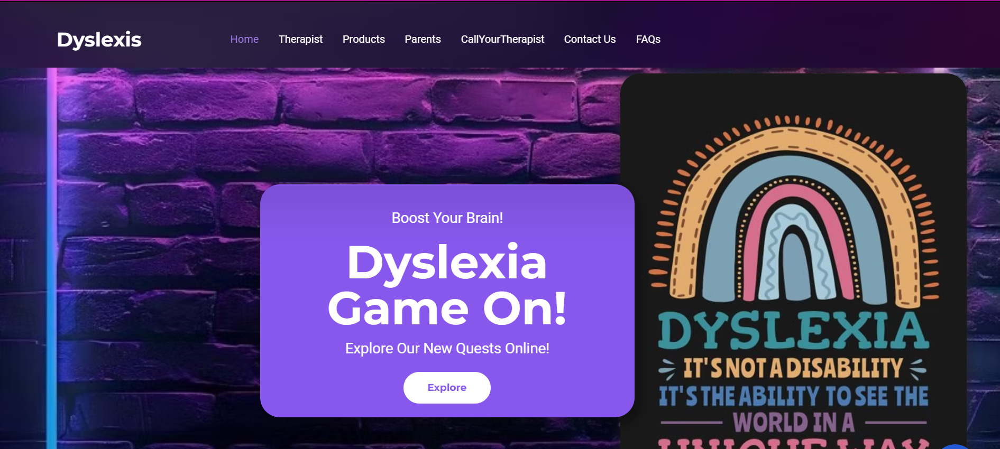
Game 1
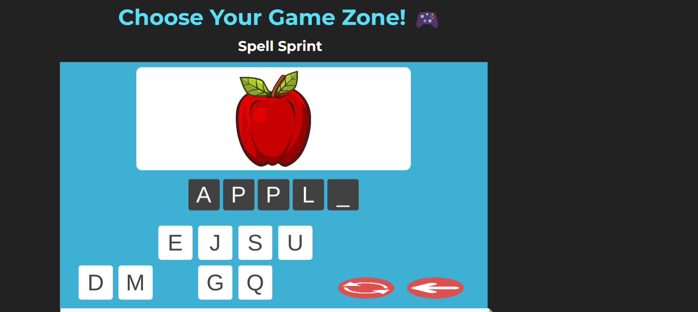
Game 2
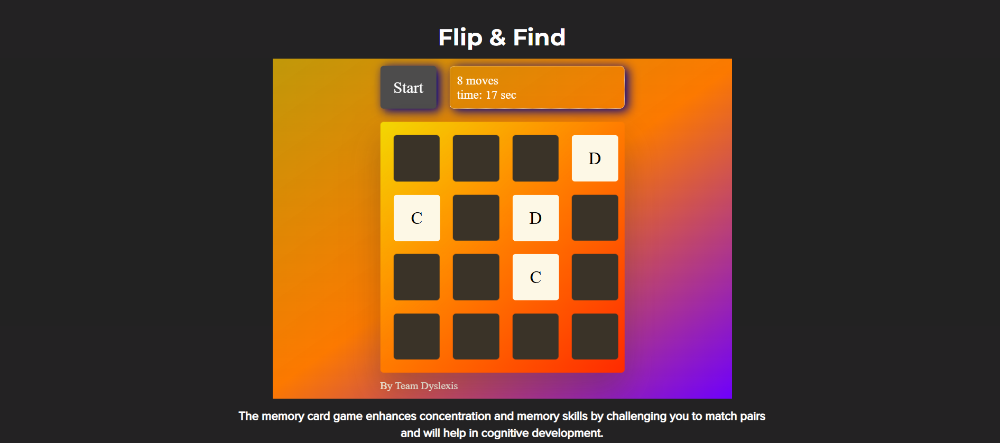
Game 3
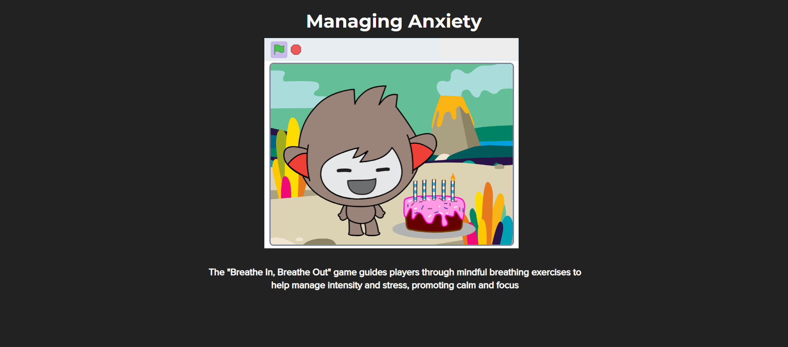
Game 4
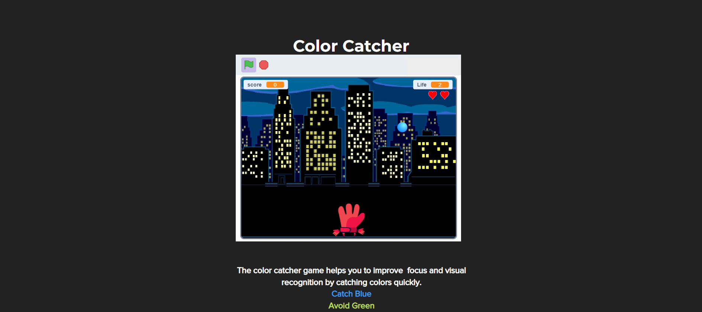
Game 5
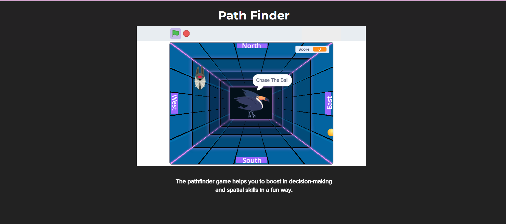
Game 6
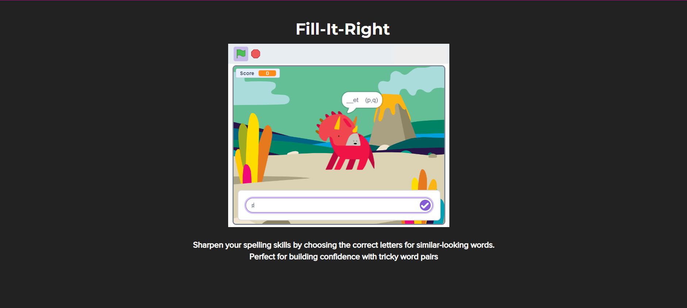
Game 7
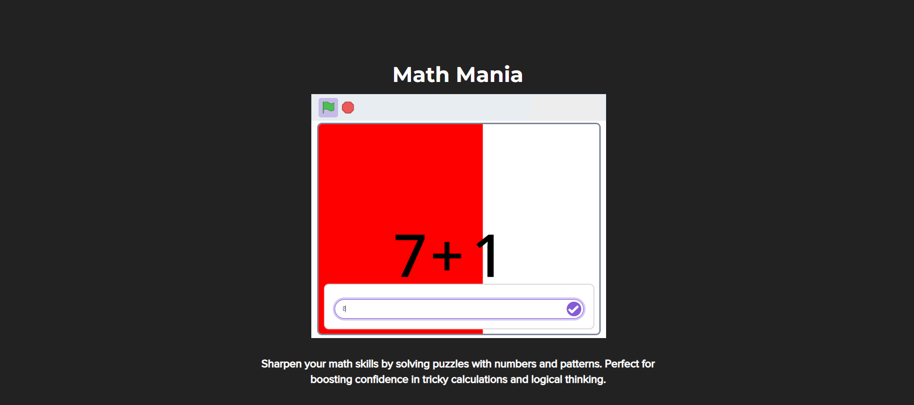
ChatBot
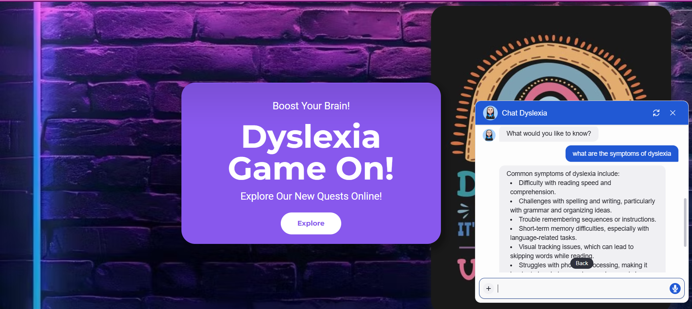
About Us
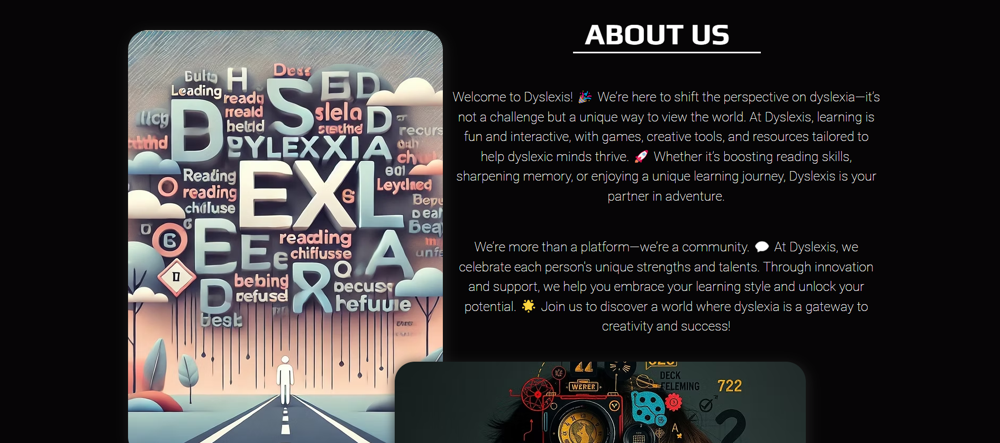
Services
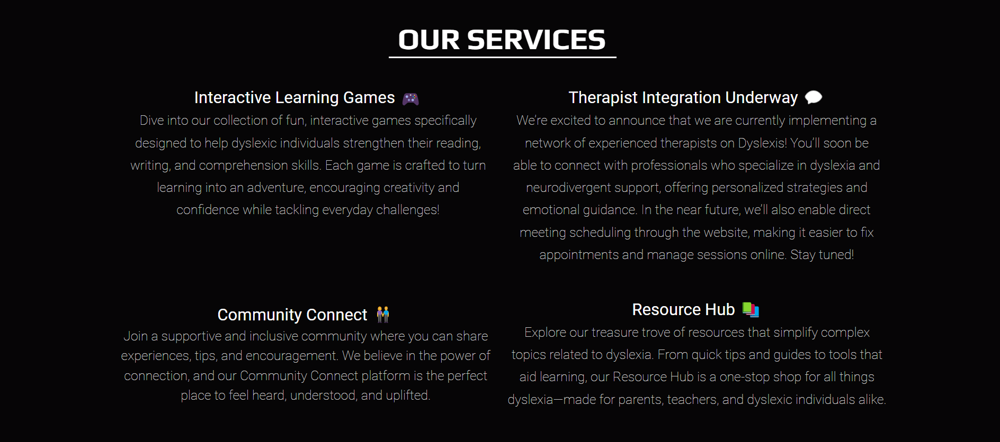
Products
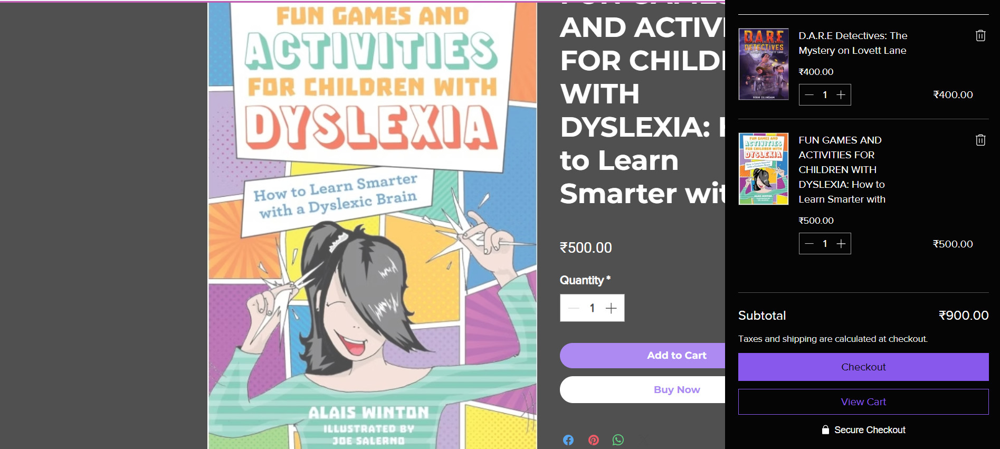
Therapist
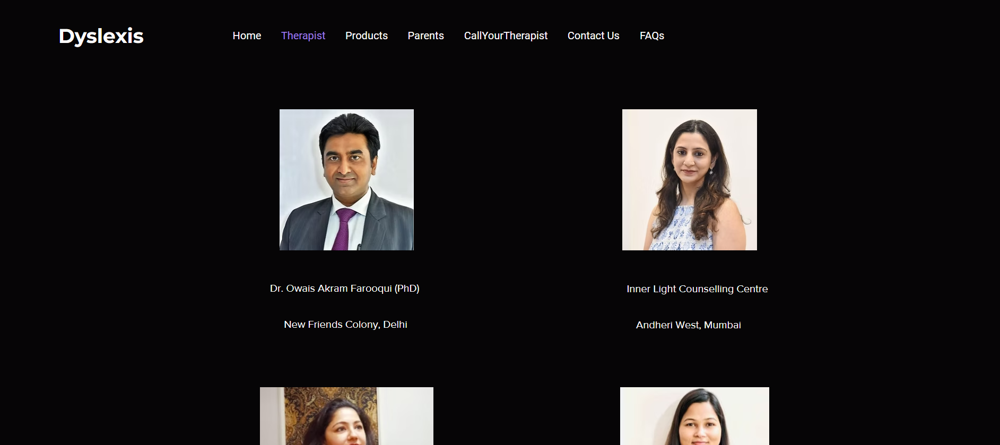
Parents
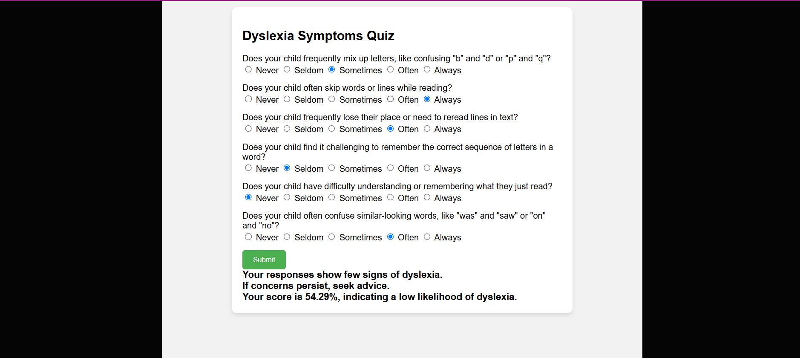
Meeting
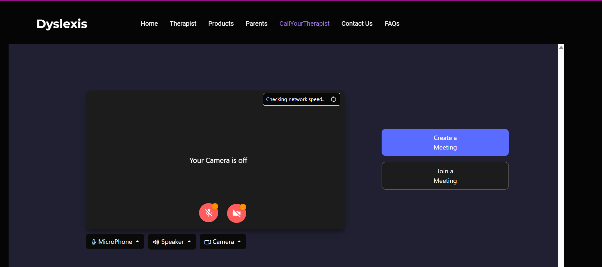
Blogs
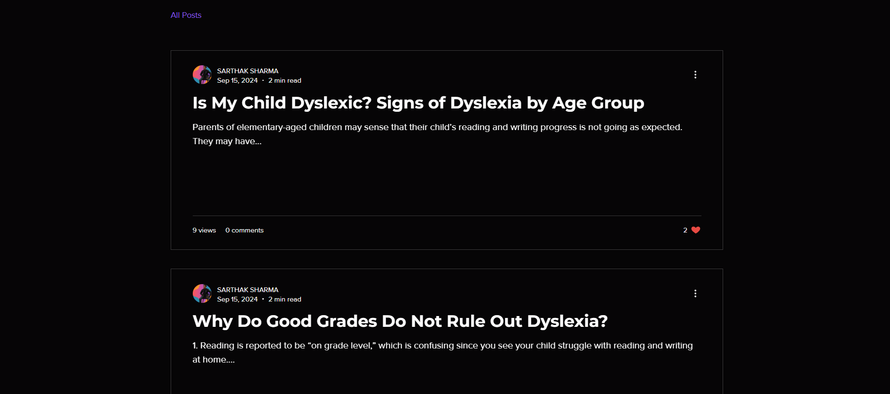
Contact Us
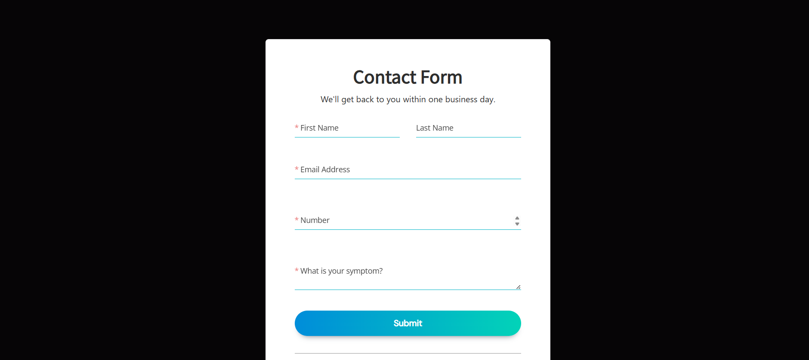
FAQs
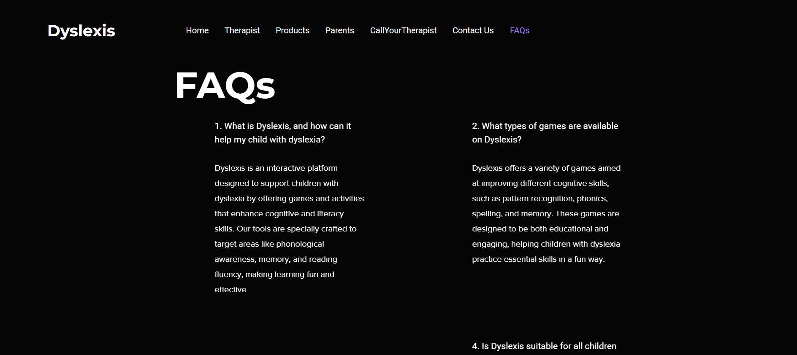

---

## ⚠ Disclaimer

This project was developed using *Wix Studio*, for rapid prototyping during a hackathon. While traditional code is minimal, the logic, datasets, AI models, and integrations were ideated and partially implemented using external tools like Scratch, Unity, and BotPress.

---

## ✨ Team & Credits

Built with 💙 by Team Dyslexis  

---

## 📽 Demo Video

(https://drive.google.com/file/d/18W677OwEccaumrcesqgD8r2jEnqhppM2/view?usp=sharing)

---
